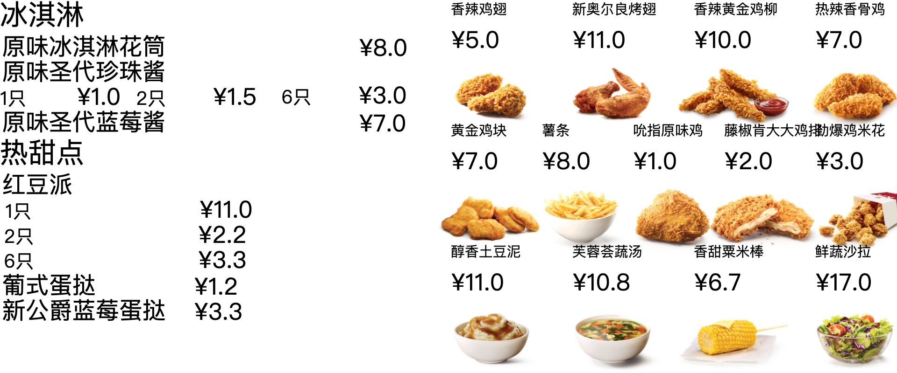

# template-editor-demo

A poster template edit and generation design document and demo.

[](https://david-dm.org/plantain-00/template-editor-demo)
[](https://david-dm.org/plantain-00/template-editor-demo#info=devDependencies)
[](https://travis-ci.org/plantain-00/template-editor-demo)
[](https://ci.appveyor.com/project/plantain-00/template-editor-demo/branch/master)
[](https://github.com/plantain-00/template-editor-demo)

## design document

### 需求分析

海报有多个设计元素（文字、图片等）组成，多个海报可能很相似，例如一段文字不同，所以可以通过制作海报模版的方式，海报模版可以根据不同的海报输入，生成不同的海报。

### 数据结构

模版和海报的数据结构类似，而且都有一些相同的行为，例如编辑、渲染，所以采用同一个数据结构。

作为内容的设计元素的数据结构，除了设计元素特有的字段外，还有最底层的 `Region` 字段来表示设计元素的位置和大小。后续可以增加更高级的字段，例如布局、边距、对齐等，通过布局引擎计算后应用到 `Region` 字段上。

```ts
interface Template extends Size {
  contents: TemplateContent[]
}

type TemplateContent = TemplateTextContent | TemplateImageContent

interface TemplateTextContent extends Region {
  kind: 'text'
  text: string
  fontFamily: string
  fontSize: number
  color: string
}

interface TemplateImageContent extends Region {
  kind: 'image'
  url: string
}

interface Position {
  x: number
  y: number
}

interface Size {
  width: number
  height: number
}

interface Region extends Position, Size { }
```

### 数据验证

通过 <https://github.com/plantain-00/types-as-schema> 来根据 typescript 代码中定义的数据结构模型来生成 json schema，并用于验证数据合法性。

### 模版引擎

受 web 开发的 html 模版引擎的启发，海报模板也可以使用模版引擎来简化生成逻辑，只不过操作的是设计元素而不是 html 标签。

可以在设计元素上，增加可选的循环和条件的声明字段，循环和条件同时存在时，先执行循环，循环里执行条件。

```ts
interface GenerationField {
  if?: string
  repeat?: string
}
```

语法上，条件的语法设计为一个表达式，例如

```json
{
  "if": "commodity.prices.length == 1"
}
```

而循环的语法设计为

```txt
commodities
commodity in commodities
(commodity, index) in commodities
```

### 表达式引擎

模版引擎中使用了表达式，这里使用 <https://github.com/plantain-00/expression-engine> 来计算表达式结果。

而在设计元素中，增加表达式字段可以方便设置字段值，例如

```json
{
  "kind": "text",
  "text": "demo text",
  "textExpression": "commodity.name"
}
```

表达式字段总是 optional 的，并放在待设置的字段旁边，命名可以是 `要设置的字段名称 + "Expression"`，例如

```ts
interface TemplateImageContent extends Region, RegionExpression {
  kind: 'image'
  url: string
  urlExpression?: string
}
```

如果表达式存在，并且表达式的计算结果有效，表达式的计算结果更优先。

### 组件

制作海报模版时，经常会有一些类似的设计元素组合需要能够复用，受 web 开发的 reactjs 组件的启发，引入组件来实现这个功能。

组件的数据结构设计为和海报一样，可以定义参数，用于声明参数的名称

```ts
interface Template extends Region, SizeExpression {
  id: string
  contents: TemplateContent[]
  parameters?: string[]
}
```

组件内可以通过表达式拿到参数值，例如 `props.text`

使用组件时，则需要提供组件需要的参数，例如 `{ text: 'test text' }`

```ts
interface TemplateReferenceContent extends Position, PositionExpression, GenerationField {
  kind: 'reference'
  id: string
  props?: string
}
```

`TemplateReferenceContent` 没有定义 `Size`，因为 `Size` 是由它引用的组件的 `Size` 来决定的。

在模版中，是通过引用的方式来使用组件的（这样数据量更小，而且无需数据同步），但在生成的海报中，希望是组件的 snapshot 而非引用，因为组件可能在生成之后再修改

```ts
interface TemplateSnapshotContent extends Position, PositionExpression {
  kind: 'snapshot'
  snapshot: Template
}
```

模板中通过引用来使用组件后，一个六层嵌套的模板和使用的组件数据量之和只有 6.4KB。

### 布局引擎

直接操作设计元素的 `x` 和 `y` 比较 low-level，受 css 里 flex 布局的启发，引入简单的 flex 布局，可以在 `Template` 上设置相关的参数

```ts
interface FlexField extends MarginField {
  display?: 'flex'
  flexDirection?: 'row' | 'column'
  justifyContent?: 'start' | 'end' | 'center' | 'between'
  alignItems?: 'start' | 'end' | 'center'
}

interface MarginField {
  marginLeft?: number
  marginRight?: number
  marginTop?: number
  marginBottom?: number
}
```

布局引擎会根据 `Template` 上设置的 `FlexField`，修改里面所有内容的 `x` 和 `y`。

有了表达式引擎、模板引擎、组件、布局引擎后，就可以实现一些比较复杂的海报效果的生成了 

### 其它模版和海报数据结构不一致的地方

有一些比较耗时的操作，例如文字排版、图片像素处理等，是希望把操作结果也保存在生成的海报中的，以避免海报使用时执行这些操作。

但模版在使用（编辑、生成海报）时，总是需要执行这些耗时操作的，所以这些字段不需要保存在模板中，以减少数据量。

### 模版编辑器和海报生成的特点

编辑器里进行拖动等操作时会触发大量事件，如果每次都执行那些耗时操作会卡，所以需要缓存机制，可以使用 mobx 或 vuejs 的 computed 机制。

海报生成时，则不希望有 computed 机制，不然每次设置字段都会触发无效的代码执行，影响海报生成效率。

所以 computed 机制还是仅限于 UI 组件内，数据模型里不应该有 computed。

### 渲染引擎

渲染要支持 canvas （用于生成海报图片）和 UI 组件（用于在编辑器内显示、编辑时局部刷新）。

渲染成 UI 组件时，耗时操作、表达式计算等可以放在 UI 组件内的 computed 里。

### 编辑器结构

编辑器画布从内而外大致分为下面几层：

1. 模板渲染层：只依赖模板数据的渲染结果
2. 编辑状态渲染层：还依赖编辑器状态的渲染结果，例如选中效果、hover 效果、拖拽效果
3. mask 层：用来方便接收用户操作事件的透明层
4. 用户可以直接操作的 UI 层：例如快捷菜单

### 模板预编辑

在生成阶段，模板是只读的，且可能会多次使用在多个输入数据上，对模板进行预编辑，预先处理模板中的模板语法和表达式，可以提高生成时的效率。

生成 19 个商品组成的海报，耗时由没有预编辑时的 26.8ms 减少到了加了预编辑时的 18.2 ms。

### 内容的 z 轴顺序

```ts
interface Position {
  x: number
  y: number
  z?: integer
}
```

渲染为 canvas 时，按内容的 z 从小到大绘制。

渲染为 UI 组件时，通过 css z-index 来实现。

z 未设置时是 0。

组件中，和 x y 的逻辑一样，内容的 z 值是一个相对值。

## todo

+ preset expression(get part of array)
+ intellisense(props)
+ repeat expression ui
+ expression ast ui
